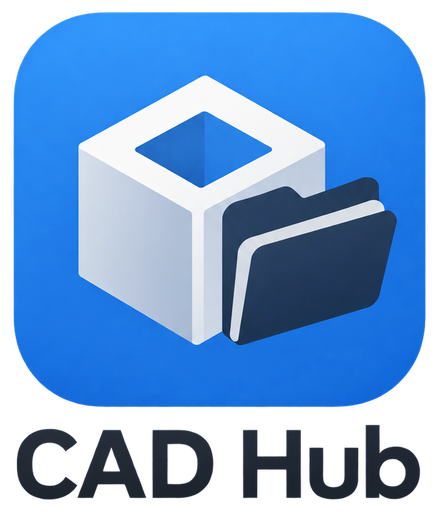

# CAD Hub

Team CAD for FRC teams that use SOLIDWORKS: an add-in plus a small team server, built and used by [FRC Team 5919 (JOCO ROBOS)](https://cad.team5919.org/). (It was called JOCO ROBOS CAD before 1.4.) It lets the whole team work on one robot without overwriting each other's work. Students only see:

**Open Robot → CAD normally → Library when you need a part → Submit**

Everyone keeps a full copy of the robot on their own computer (fast). The team server keeps the history and hands out **exclusive edit locks**: while you're editing a file, nobody else can change it.

**Want it for your team?** It's free and open source (MIT). A mentor runs the server on any Linux computer with Docker: see **[Set up for your team](docs/SETUP.md)**.

## For students

1. **Install:** download the newest `JOCO-ROBOS-CAD-Setup-x.y.z.exe` from [Releases](https://github.com/Imdad3456/joco-robos-cad/releases/latest) and run it. Windows warns about an unknown publisher; click **More info → Run anyway**.
2. **Set up your account:** start SOLIDWORKS and type your team's server address (your mentor tells you; Team 5919: `cad.team5919.org`). Choose a username and password, and click **Send request**. A mentor gives you a code; type it in and click **Finish**. You won't need to type it again.
3. **Daily work:**
   - **Open Robot** gets teammates' latest work and opens the robot. Everything is read-only until you change it.
   - **Just start CADing.** The first change to a part locks it for you (or select a part and click **Edit**). If a teammate is editing it, you're told right away, and **Ask … for it** lets them know you're waiting. You're told the moment it's free.
   - **Save** normally. New parts go anywhere inside your robot folder.
   - **Submit** when you're done: one window lists your files and fixes any problems. The panel confirms it.
4. **The CAD Hub panel** (right side) shows only what you need right now. At the top: is the robot up to date (hover for what's new), and the one button for the next step (Open Robot, or Close & Update when teammates have new changes). **This file** says who has the open document, with Edit or **Ask … for it**. **My work** lists every file you're editing or added (*unsaved*, *saved*, *new*, *not changed*), who's waiting for one, and **Submit**. Below that, **Robot Files** lists the robot's folders and parts with who's working on what right on each row (✎ you, 🔒 a teammate's name, ● new, ⬇ a newer version from a teammate; folders add it up): search by name or folder, double-click to open, right-click to ask for a file. Teammates' changes come in by themselves whenever none of your robot documents are open. The **Library** tab finds any part: the team Library and [FRCDesignLib](https://frcdesign.org/resources/frcdesignlib/) (motors, bearings, tube…) in one search, plus "Import a downloaded CAD file" for vendor downloads.

**Modeling tools** live on the **CAD Hub tab** in SOLIDWORKS' CommandManager; team work (Open Robot, Edit, Submit, Library) stays in the CAD Hub panel. They open in the left side panel (PropertyManager), remember your last settings, and need no Onshape calls:
- **Lighten Plate**: click a plate's face; pockets with ribs between its holes (close holes count as one group) and its corners, following round holes and curved edges with arcs, rounded for your router bit. ✓ cuts them as an ordinary cut and says the weight saved.
- **Spur Gear**, **Sprocket** (#25/#35), **Timing Pulley** (HTD 5 mm, GT2 3 mm, flanges) and **Shaft** (hex or round, turned ends): editable **CAD Hub features** in a part (right-click → Edit Feature to change them), with bore, hub and backlash options. In an assembly, the part is saved into the robot (`90_COTS/Stock/…`) and inserted.
- **Gear Ratio**: motor, up to three stages and a wheel → ratio, output speed and robot speed.
- **Mounting Pattern**: click a face (or a round hole's edge to center on it) → motor face (NEO, NEO Vortex, Kraken X60, Falcon 500, CIM: #10 on the 2" circle with the 3/4" pilot), VersaPlanetary face, or the REV MAX / ThriftyBot 1/2" grid around a 1.125" bearing bore; turn it, preview it, ✓ cuts it. The panel says what's cut and where the numbers come from.
- **Belt and Chain**: center distance for HTD/GT2 belts and #25/#35 chain as you change the numbers, or the lengths either side of a distance you want; click a dimension into its box and ✓ sets it, or a flat face or plane and ✓ draws the layout sketch (pitch circles and belt path).

In search, **⚡** marks FRCDesignLib parts the team Library already has (instant); with nothing typed, the Library tab shows the team's most-used parts. The **×** box next to Insert adds several at once.

Everything else is in **Tools → CAD Hub**, in sections: everyday extras (Update, Release Edit, Choose Robot, Open Old Robot, File History, Parts List, Where Used), your account (Sign In, Change Password, Test Connection, Check This Computer, Copy Diagnostics), and recovery tools (Set Aside My Changes, Recovery Copies, Restore Deleted Files, Import Outside References, Repair Moved References, Upgrade Robot Files).

**Recovery copies:** while you're editing a part or assembly and haven't saved, CAD Hub quietly keeps a copy every few minutes (only when you pause), outside the robot folder. If SOLIDWORKS closes unexpectedly, the next start tells you which files had unsaved work and opens the copies. Tools → CAD Hub → **Recovery Copies** opens them any time; they're kept 14 days.

**Something wrong?** Click **Diagnostics** at the bottom of the panel (or Tools → Copy Diagnostics). It goes straight to your mentors' Diagnostics tab, and is also copied so you can paste it. It never includes passwords or codes.

## For mentors

Everything is on your server's mentor page, **https://*your server*/admin** (Team 5919: https://cad.team5919.org/admin):

| Tab | Use it to |
|---|---|
| **Seasons** | Check health (backups, disk), see **who's working** (online, how current their robot is, what they're editing), create the next season, choose which season students open, archive old ones, see recent submits and **undo** a bad one |
| **Parts** | The robot's parts list (sent from SOLIDWORKS with **Tools → CAD Hub → Parts List**): what to buy by vendor with part numbers, what to make, quantities, what changed since the last list, and a spreadsheet download |
| **Locks** | See who's editing what and since when; release a lock someone abandoned (after they've confirmed they're done: releasing doesn't keep their unsubmitted changes) |
| **Library** | Add reusable parts; see what's been imported from FRCDesignLib |
| **Accounts** | Give waiting students their code (they asked from SOLIDWORKS with their own username and password), reject requests you don't recognize, reset a forgotten password, see add-in versions |
| **Diagnostics** | Read the reports students send with the panel's **Diagnostics** link (what they run, what's changed and locked, recent errors; never passwords) |
| **Add-in** | Release a new add-in version to everyone; set the team's **approved SOLIDWORKS version** (a newer SOLIDWORKS can look but not edit or submit, so nobody upgrades the shared files by accident) |

**New add-in versions:** other teams download each release's installer from [Releases](https://github.com/Imdad3456/joco-robos-cad/releases) and publish it on their Add-in tab ([setup step 5](docs/SETUP.md#5-set-up-the-mentor-page)). Making a release (this repository's maintainers): bump `<Version>` in `src/JocoRobos.Cad/JocoRobos.Cad.csproj`, commit, then `git tag vX.Y.Z && git push origin main --tags`. GitHub builds the installer, publishes the release, and stages it on Team 5919's server; click **Release to students** there.

## What's in this repository

| Folder | What it is |
|---|---|
| `src/JocoRobos.Cad/` | The SOLIDWORKS add-in (C#, .NET Framework 4.8). `Addin.cs` holds the commands, `SvnWorkspace.cs`/`SvnSubmit.cs` the version-control work (Subversion), `SubmitWindow.cs`/`SubmitCheck.cs` the Submit window and its checks, `StatusPane.cs`/`FrcLibraryPanel.cs` the panel, and `Catalog.cs` the season list. |
| `server/` | The team server: the container (`Containerfile`, `svn.conf`, `entrypoint.sh`, `compose.yaml`, `team.env.example`), the mentor page and APIs (`joco.py`), FRCDesignLib (`frcdesign.py`), lock rules (`pre-*.py`), and backups. [docs/SETUP.md](docs/SETUP.md) sets one up; [server/README.md](server/README.md) is Team 5919's own server (a Steam Deck). |
| `installer/` | Inno Setup script for the student installer. |
| `scripts/` | Windows PowerShell: build, build the installer, register a development copy. |
| `tests/Addin.Tests/` | Add-in checks that run without SOLIDWORKS. |
| `server/tests/` | Server checks: the mentor page and APIs, plus lock rules with a real SVN client. |
| `lib/solidworks/` | Where SOLIDWORKS' API files go when building without SOLIDWORKS. They're Dassault's, so they aren't in this repository ([why and how](lib/solidworks/README.md)). |
| `tools/` | Helpers: `make-icons.py` rebuilds the toolbar icons from `src/JocoRobos.Cad/Icons/source`, and the script that sorted the 2026 robot into folders. |
| `docs/` | [Set up for your team](docs/SETUP.md), [how it works](docs/HOW-IT-WORKS.md), [developer setup](docs/DEVELOPING.md), and [the original design notes](docs/history/ORIGINAL-DESIGN.md). |
| `.github/workflows/build.yml` | On every push: build and test everything and build the installer. On `v*` tags: publish a Release and stage it on Team 5919's server. |
| [`TESTING.md`](TESTING.md) | The hands-on test sheet for two people. |

The repository is public so students can download releases and other teams can run it. It contains **no passwords or keys**: those live only on each team's server and in GitHub's encrypted secrets.

**License:** [MIT](LICENSE). SOLIDWORKS is a trademark of Dassault Systèmes; this project isn't affiliated with them.

## Status

**In daily use by Team 5919 since 1.0.0**, confirmed by the two-person release test, an uncoached student, and team use in SOLIDWORKS 2026. Fix releases anything that could lose or overwrite work, break someone else's robot, block recovery, or make Open → CAD → Submit confusing; new features come in 1.1 and later.

**Known limits (on purpose, for 1.0):**
- Only SOLIDWORKS files (parts, assemblies, drawings) are shared. Excel design tables, decals, textures and Toolbox data aren't synced; Submit doesn't check them.
- Renaming, moving or deleting team CAD is a mentor task.
- Locking an assembly doesn't lock the parts inside it.
- Locks never expire by themselves; a mentor releases abandoned ones.
- Teammates' changes can't come in while you have unsubmitted work (Submit first).
- No working offline beyond files you already locked; no branches or "experiment copies" (File History can save an older version as a separate copy to look at).
- FRCDesignLib options that take text stay at their defaults (numbers such as custom lengths work).
